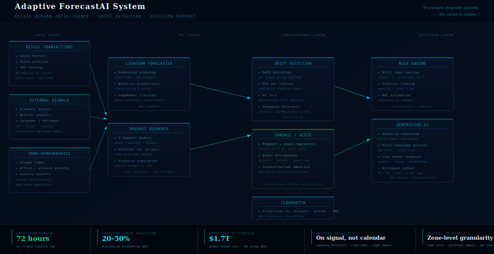

# Adaptive ForecastAI System

> *Forecasts degrade silently. This system makes it visible.*

ML-powered demand forecasting drift detection for retail — detects model degradation before it costs margin, separates chronic drift from acute shocks, and translates signals into store-level replenishment actions within a 72-hour window.

---

## The Problem

Machine learning forecasting models erode silently when economic conditions shift. No alarm fires. Replenishment decisions keep running on flawed predictions. The gap between what the model expects and what the market does widens — until the write-down.

The industry-typical lag between model degradation and human detection is 3 weeks. This system targets 72 hours.

---

## What It Does

**Detect** — Continuous drift measurement across 30 features simultaneously using MAPE deviation, Population Stability Index (PSI), and Kolmogorov-Smirnov tests. Escalates only when multiple signals cross a compound threshold — noise filtered, false alarms suppressed.

**Diagnose** — Separates chronic drift (gradual structural erosion) from acute shocks (sudden event-driven breaks). The same economic event hits office-zone stores at -40% while student-zone stores remain stable. Aggregate metrics hide this entirely — the system surfaces it.

**Act** — Priority-ranked replenishment actions with ROI estimates. Not "model degrading" — "reduce orders 20% in suburban stores, SKU-level, by tomorrow morning." Generative AI layer translates drift signals into plain-language operational decisions.

---

## Architecture



Three layers, each with a distinct role:

- **ML layer** — LightGBM forecaster establishes baseline predictions per store/SKU segment
- **Measurement layer** — Evidently AI runs PSI + KS drift detection; AWS CloudWatch monitors prediction vs. actuals in production
- **Decision layer** — Rule engine routes drift signals to priority actions; AWS Bedrock (Claude) generates scenario reasoning and natural-language recommendations

---

## Stack

| Layer | Technology |
|-------|-----------|
| Forecasting | LightGBM (segmented by store type x SKU category) |
| Drift detection | Evidently AI — PSI, KS test, MAPE monitoring |
| Chronic/acute separation | Prophet with shock regressors — chronic drift vs. acute shock |
| Cloud infrastructure | AWS SageMaker, S3, CloudWatch, EventBridge |
| Generative AI | AWS Bedrock — Claude Sonnet |
| Dashboard | Flask + vanilla JS, 4-tab interactive |

---

## Key Design Decisions

**Retrain on signal, not calendar.** A model retrained on drifted data without knowing it is drifted learns to reproduce the distortion. The value is knowing precisely when to retrain, on what data window — once, at the right moment.

**Chronic vs. acute separation matters.** A VAT shock and a promotional residual both move MAPE — but require opposite responses. Treating them as the same signal produces wrong actions. The system classifies regime before routing to the action engine.

**Spatial heterogeneity is not optional.** An economic austerity event hits salaried-worker zones immediately and leaves student zones untouched. A model that aggregates across store types will average out the signal and miss both the severity and the opportunity.

---

## Repository Structure

```
app/          Flask backend + JS/HTML dashboard (4 tabs)
config/       Store profiles, SKU catalog, constants
data/         Synthetic dataset + drift reports + actionables
models/       Trained LightGBM + Prophet segment models
scripts/      Data generation, drift detection, actionables engine
utils/        Logger
docs/         Architecture, thread specs, handoff documents
```

---

*Built by Stefan · March 2026 · Working demonstration available on request.*
